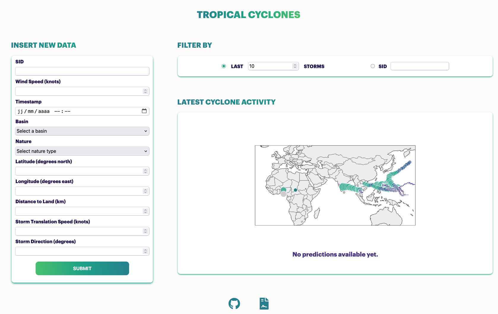

# Tropical Cyclones

Tropical Cyclones Severity Prediction.

## Overview

Check out this [video](ADD LINK HERE) for a demonstration on how to start and use the web app.




Homepage:
- `INPUT NEW DATA` Form to add new data.
- `FILTER BY` Shows the n latests storms on the map or just a specific storm with its ID.
- `LATEST CYCLONE ACTIVITY` Shows an interactive world map with the desired storm data points with downloadable png capability.

## Installation guide

1. ```pyenv install 3.13.1```

2. ```pyenv global 3.13.1```

3. ```pip install --upgrade pip```

4. cd to the project's folder.

5. ```python -m venv .venv```

6. ```source /bin/activate/.venv (for Windows)```

7. ```source .venv/bin/activate (for macOS)```

8. ```pip install -r requirements.txt```
If the requirements install fails for any reason, install the packages manually:
```pip install jupyterlab numpy pandas plotly pyarrow scikit-learn django```

9. To create a .env file at the root of the project to store Django's secret key: ```echo "DJANGO_SECRET_KEY=value" > .env```
While in development stage, replace the word value with a secret key of your chosing.

## Start the backend (Django)

Please start the server while being in the folder "web_app":

1. Use this command to start the server: ```python manage.py runserver```

If you get a message telling you in the terminal that you need to migrate:

2. Stop the server.

3. ```python manage.py makemigrations app```

4. ```python manage.py migrate```

5. Relaunch the server: ```python manage.py runserver```

## Resources

### Dataset

- IBTrACS [dataset](https://www.ncei.noaa.gov/products/international-best-track-archive) from the National Centers for Environmental Information [(NOAA)](https://www.ncei.noaa.gov/)
