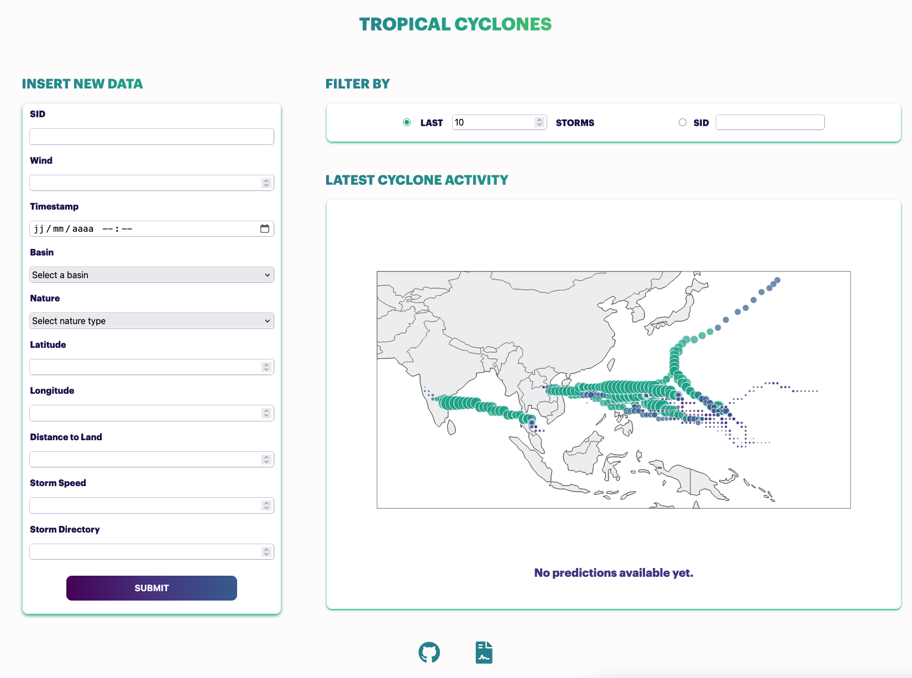

# Tropical Cyclones

Tropical Cyclones Severity Prediction.

## Additional Resources

To use the web app with the machine learning model, you need to download the weights of the model, the file was to heavy for GitHub: 
https://app.filen.io/#/d/a9bab9bd-bed4-42b0-a18c-f0ed03b58b94%23wbG418NQ8dS0986xije4GXW3GteeQYLW

## App Overview

### Demo

Check out this [video](../assets/video/demo.mp4) for a demonstration on how to start and use the web app.

### Visuals

Homepage:

- `INPUT NEW DATA` Form to add new data.
- `FILTER BY` Shows the n latests storms on the map or just a specific storm with its ID.
- `LATEST CYCLONE ACTIVITY` Shows an interactive world map with the desired storm data points.

- If you hover over the submit button or the buttons in the footer, the color will change:

## Installation specifics for the backend

A secret key is set in the file .env at the root of the web_app folder.
While in development stage, replace the word value with a secret key of your chosing.

## Start the backend (Django)

Please start the server while being in the folder "web_app":

Use this command to start the server: `python manage.py runserver`
