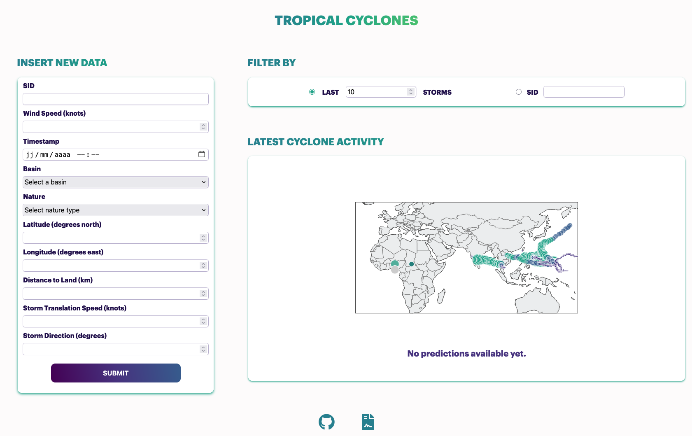

# Tropical Cyclones

Tropical Cyclones Severity Prediction.

## App Overview

### Demo

Check out this [video](ADD LINK HERE) for a demonstration on how to start and use the web app.

### Visuals

Homepage:
- `INPUT NEW DATA` Form to add new data.
- `FILTER BY` Shows the n latests storms on the map or just a specific storm with its ID.
- `LATEST CYCLONE ACTIVITY` Shows an interactive world map with the desired storm data points.


- If you hover over the submit button or the buttons in the footer, the color will change:




## Installation specifics for the backend

To create a .env file at the root of the project to store Django's secret key:

```echo "DJANGO_SECRET_KEY=value" > .env```

While in development stage, replace the word value with a secret key of your chosing.

## Start the backend (Django)

Please start the server while being in the folder "web_app":

1. Use this command to start the server: ```python manage.py runserver```

If you get a message telling you in the terminal that you need to migrate:

2. Stop the server.

3. ```python manage.py makemigrations app```

4. ```python manage.py migrate```

5. Relaunch the server: ```python manage.py runserver```

## Resources

### Dataset

- IBTrACS [dataset](https://www.ncei.noaa.gov/products/international-best-track-archive) from the National Centers for Environmental Information [(NOAA)](https://www.ncei.noaa.gov/)
